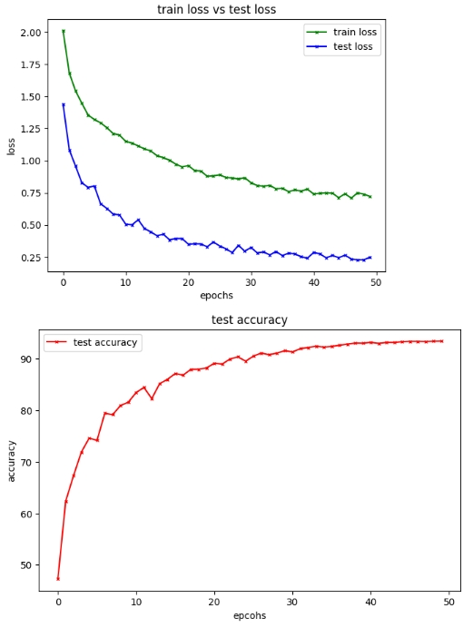
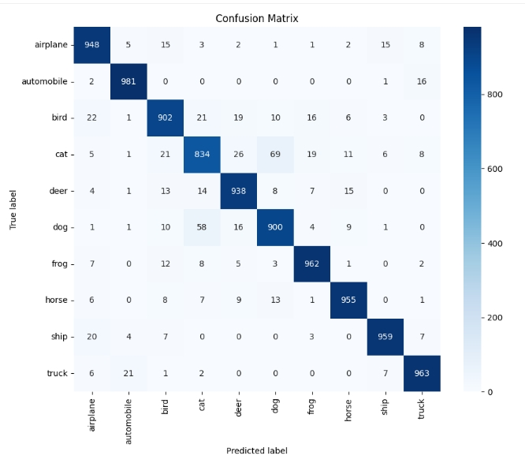

# Vit-on-small-data

In this repo, we present the lightest Vision Transformer (ViT) trained from scratch to achieve **93.37 ± 0.07%” top-1 accuracy** on CIFAR-10 within just 50 epochs.  
<br>
To the best of our knowledge, our model lies on the Pareto frontier of CIFAR-10 ViTs trained from scratch achieving ≈93.4% accuracy with 2.38M parameters and just 50 epochs.
No other published ViT, at this size and training budget, achieves higher accuracy with lower compute.
---

##  Introduction
Vision Transformers (ViTs) are among the most impactful architectural innovations in computer vision, demonstrating that autoregressive architectures can be applied to image data while achieving state-of-the-art results. However, ViTs are notoriously data-hungry; their performance scales strongly with dataset size, making them less effective on smaller benchmarks. To address this limitation, we conducted extensive ablation studies to isolate the core inefficiencies of ViTs on small datasets and propose a minimal yet effective modification. Our approach enables ViTs to achieve competitive accuracy on CIFAR-10 with a significantly reduced computational footprint and faster convergence, offering a lightweight solution for resource-constrained training scenarios.

---
##  Key Ablation:


As widely recognized, the primary reason behind Vision Transformers (ViTs) underperforming on small datasets is their lack of *instant inductive bias*. ViTs gradually accumulate meaningful feature representations but typically require large datasets and prolonged training to do so effectively. 

In contrast, Convolutional Neural Networks (CNNs) excel at extracting high-level features early in training due to their convolutional layers, which inherently encode spatial inductive bias.

To address this gap, we replaced the raw linear patchification step in vanilla ViTs with a **3-block CNN-based patch embedding**. This small change introduces inductive bias from the very first layer, resulting in **faster convergence** and **better accuracy** on small datasets such as CIFAR-10.

---


## 📐 Experiment Configuration

| **Component**          | **Value** |
|------------------------|-----------|
| **Dataset**            | CIFAR-10 |
| **Image Size**         | 32×32 |
| **Augmentations**      | `RandomCrop(32, padding=4)`, `RandomHorizontalFlip`, `TrivialAugmentWide`, Normalize (mean = `[0.4914, 0.4822, 0.4465]`, std = `[0.2470, 0.2435, 0.2616]`) |
| **Batch Size**         | 32 |
| **Num Workers**        | 2 |
| **Pin Memory**         | `True` |
| **Patch Embedding**    | CNN-based projection to `embedding_dim=192` |
| **Transformer Layers** | `2` |
| **Attention Heads**    | `2` |
| **Attention Dropout**  | `0.0` |
| **MLP Size**           | `1152` |
| **MLP Dropout**        | `0.1` |
| **Embedding Dropout**  | `0.1` |
| **Optimizer**          | AdamW (`lr=2e-3`, `weight_decay=0.001`, `betas=(0.9, 0.999)`, `eps=1e-8`) |
| **Scheduler**          | Cosine Decay with Warmup (`warmup_steps=21000`, `total_steps=78125`) |
| **Mixup**              | `alpha=0.2` (λ ~ Beta(α,α)), applied to every training batch via `mixup_data(x, y, alpha=0.2, device='cuda')`. Returns `(mixed_x, y_a, y_b, lam)` and uses a random permutation for pairing. |
| **Loss Function**      | `CrossEntropyLoss` combined with `mixup_criterion(loss_fn, pred, y_a, y_b, lam)` |
| **Gradient Clipping**  | `clip_grad_norm_(model.parameters(), max_norm=1.0)` |
| **Random Seed**        | `42` |


## Results:

- loss and accuracy:
<p align="center">
  
</p>

- confusion matrix:
<p align="center">
  
</p>

<br>

## 📊 Models Comparison
Although there are a quite few repos/papers reporting accuarcies on Vits trained from scratch. However, to avoid redundancy, we pick the top models on all metrics to compare against:

| Model                | Params (M) | FLOPs  | Accuracy (%) | Epochs | Source | Key Differences from Base ViT |
|----------------------|-------------|--------|---------------|---------|--------|----------------------------------|
| **Our ViT (CNN-Patchified)** | **2.38**       | **348M (174M MACS)** | **93.42**     | **50**   | [Google Colab](https://colab.research.google.com/drive/1mmhjZ6dS69L9zK99P8OJKXaEfWZtskTm?usp=sharing) | Only replaces raw patches with CNN-based patch embedding (adds inductive bias); rest of architecture similar to standard ViT |
| CCT-14/7x2           | 3.76        | 2.38G  | 96.53          | 300     | [paper](https://arxiv.org/pdf/2104.05704) | Uses convolutional tokenization; sequence-pooling; convolutional token embedding and projection; reduces tokens hierarchically; retains linear Q/K/V in MSA |
| Add-ViT              | 26.8        | *4.36G*| 94.97          | 300     | [paper](https://link.springer.com/article/10.1007/s11063-024-11643-8) | **Several additions:**  Add-Embedding; Convolutional Prediction Module (Add-Attn / PMSA); Add-Conv (depthwise separable convolution unit); Feature augmentation via ECA (efficient channel attention).</li></ul> |


<br>

## ❌ Things we Tried (But Didn't Work)

| Experiment | Observation / Result |
|-----------|---------------------|
| **Two CLS tokens** | No accuracy improvement observed. |
| **Different weight decay factors (0.5, 0.6, 0.3, 0.4)** | No significant difference compared to default (however, accuracy slightly decreased with values other than 0.5). |
| **Mixup with different α values** | 0.2 was the sweet spot — others performed worse. |
| **Bigger batch sizes (64, 128)** | No performance gains. |
| **Embedding sizes (192 → 768)** | high compute cost, accuracy acheived a max of 90% with larger values (ended up going with 192). |
| **MLP size (4× embedding size)** | Underperformed compared to 6× embedding size (which I adopted). |
| **Two convolution blocks for patching** | Reduced spatial feature extraction — worse accuracy. |
| **Learning rates (3e-4 → 3e-3)** | Best stability/accuracy around mid-range LR (went with 1e-3); extremes hurt performance. |
| **Different heads/layers configurations** <br>*(3,3), (4,4), (6,6), (4,8), (2,3), (8,12)* | best was (2,2), other combos did not cross the 90% acc bar. |
| **Attention dropout (0.01)** | Negligible effect on accuracy. |
| **Gradient clipping** | Best value was 1, but overall effect was minimal. |
| **Step LR scheduler** | Accuracy peaked around ~87%, no breakthrough. |
| **CutMix** | Did not outperform Mixup within 50 epochs; requires longer training. |
| **Wrmup_steps in the scheduler** |  Initially tried 3% of the total steps (≈2,344) for learning rate warmup, but accuracy plateaued at 92%. Increasing the warmup steps to 20,000 (≈8.5× larger) improved accuracy. Note that using even larger warmup steps than this will likely hurt performance.
| **Seeds** | different seed values have negligble impact and do not hurt performance.|
| **torch.backends.cudnn.deterministic=True** and **torch.backends.cudnn.benchmark=False**|  Slightly decreases accuracy by ~0.20%.  |
> PS: Although I don't have the resources to try that, but training for longer steps (100--->300 epochs) will likely yield accuracy gains if model's config is tuned accordingly!


---
## Requirements

- torch
- torchvision
- numpy
- matplotlib
- seaborn
- scikit-learn

---

## Setup

Clone the repository:


      git clone https://github.com/Brokttv/Vit-on-small-data.git
      cd Vit-on-small-data


Install the required Python packages using:
   
    
    pip install -r requirements.txt


## Usage

Run the training script from the command line. You can override default parameters using command-line arguments:


    python train_vit.py --epochs 50 --batch-size 32 --lr 1e-3 --device cuda

---


## 📑 Citation

If you find this work useful, please cite it as:

```bibtex
@misc{brokttv2025vit,
  title        = {ViT-on-Small-Data: Lightweight Vision Transformer (2.38M params) achieving ≈ 93% CIFAR-10 accuracy in 50 epochs},
  author       = {Brokttv},
  year         = {2025},
  howpublished = {\url{https://github.com/Brokttv/Vit-on-small-data}},
}

